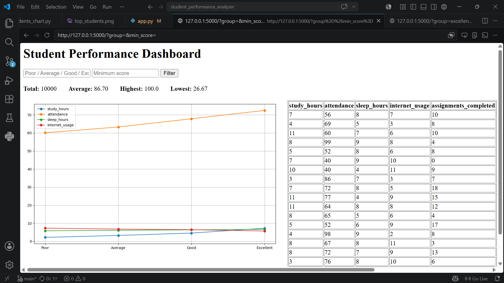
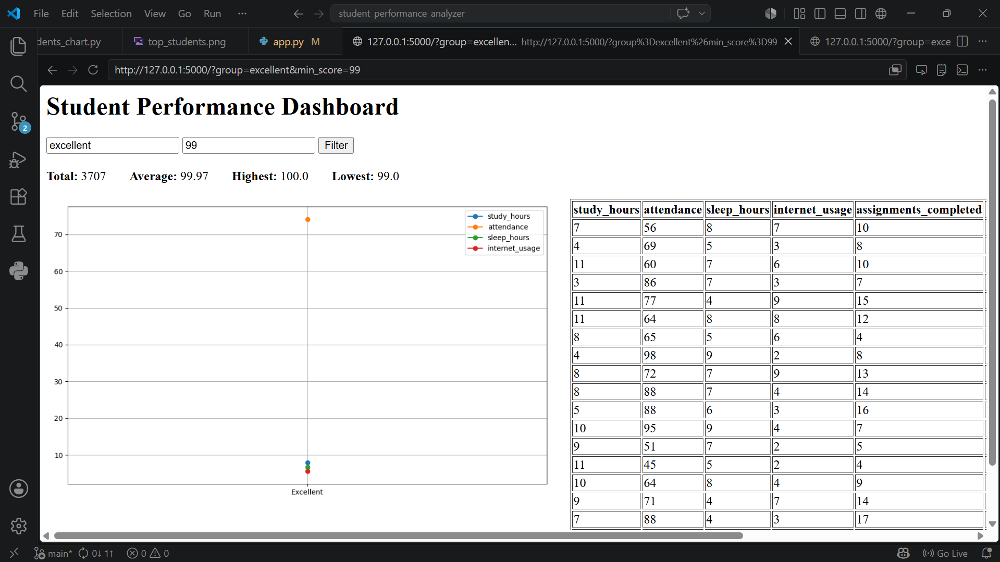
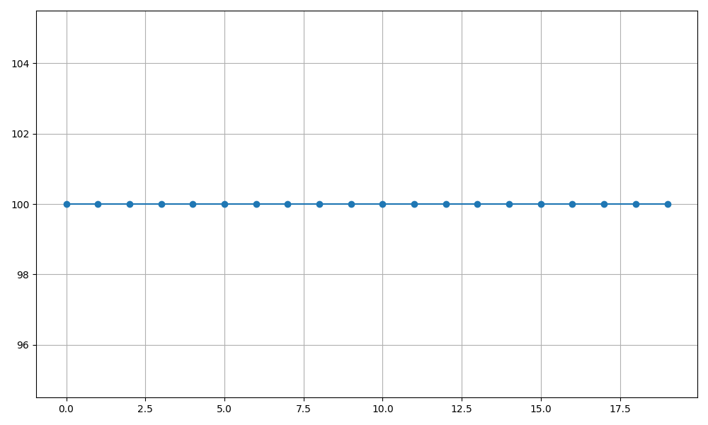

# Student Performance Analyzer

A data analytics project using Python, Pandas, NumPy, Matplotlib and Flask.

## Features

- Large real-world Kaggle dataset (10,000 records)
- Data cleaning
- Correlation analysis
- Behavioral comparison
- Score segmentation
- Interactive dashboard
- Performance filtering
- Visual reports

## Key Findings

- Study hours have strongest impact on exam score
- Attendance positively influences outcomes
- Internet usage negatively correlates
- Top students show consistent study patterns

## Screenshots

### Main Dashboard

### Filter Example

### Top Students
